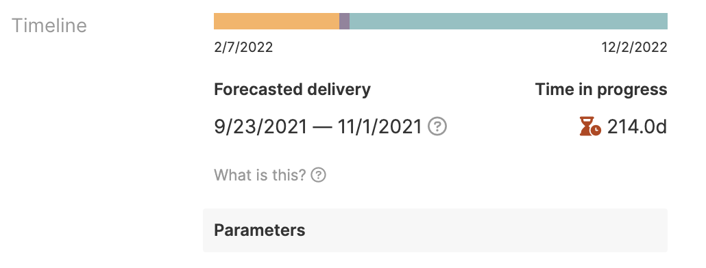

# Development timeline
  
Aha! Develop extension that explores techniques for evaluating feature estimates to forecast development timelines.

It provides these contributions:

* Timeline: A view contribution showing the projected range of how long it will take to complete a feature based on its estimate, estimation uncertainty, and team velocity.
* Estimation uncertainty: An account setting to measure how much inaccuracy to allow for during estimation. Represented as a percentage from 0-100%. Higher uncertainty means estimates are less reliable.
* Default estimate: An account setting to specify the default estimate for any unestimated records.
* Default velocity: An account setting to specify the development velocity for any records not assigned to a team.
* Total assignees: An account setting to specify the total number of developers that will work on a release.

## Demo



## Current limitations

* Requires estimation in points.
* Uncertainty defaults to 25%. Meaning for a task estimated at one day, we'd expect to see it completed within 0.75d – 1.25d. I've set this based on previous experience, but we can tune it via an extension setting.
* "Time in progress" means exactly that: total time spent in an "in progress" status. Moving it out of that status category "stops the clock."
* It'll probably break a lot. Open an issue in this repo and I'll fix it.

## What's next

- [x] Projected durations based on individual velocity
- [x] Exclude non-business-days from time in progress
- [x] Support epics and requirements
- [-] Project dates for collections of records (releases, epics, features)
    - [x] Releases
    - [ ] Epics
    - [ ] Features
- [x] Compare original vs remaining estimate projections ("trending late", "trending early")
- [ ] Explore "Sprint inflation" and "Adjusted minimum capacity" concepts
- [ ] Support time-based estimation
- [x] Factor unestimated work into timeline
- [ ] Use initial estimate if no best estimate (with a larger uncertainty)

## Installing the extension

**Note: In order to install an extension into your Aha! Develop account, you must be an account administrator.**

Install the Estimate analysis extension by clicking [here](https://secure.aha.io/settings/account/extensions/install?url=https://github.com/trydionel/development-timeline/releases/download/v0.2.0/jeff-at-aha.development-timeline-v0.2.0.gz).

## Working on the extension

Install [`aha-cli`](https://github.com/aha-app/aha-cli):

```sh
npm install -g aha-cli
```

Clone the repo:

```sh
git clone https://github.com/trydionel/estimation-analysis.git
```

**Note: In order to install an extension into your Aha! Develop account, you must be an account administrator.**

Install the extension into Aha! and set up a watcher:

```sh
aha extension:install
aha extension:watch
```

Now, any change you make inside your working copy will automatically take effect in your Aha! account.

## Building

When you have finished working on your extension, package it into a `.gz` file so that others can install it:

```sh
aha extension:build
```

After building, you can upload the `.gz` file to a publicly accessible URL, such as a GitHub release, so that others can install it using that URL.

To learn more about developing Aha! Develop extensions, including the API reference, the full documentation is located here: [Aha! Develop Extension API](https://www.aha.io/support/develop/extensions)
